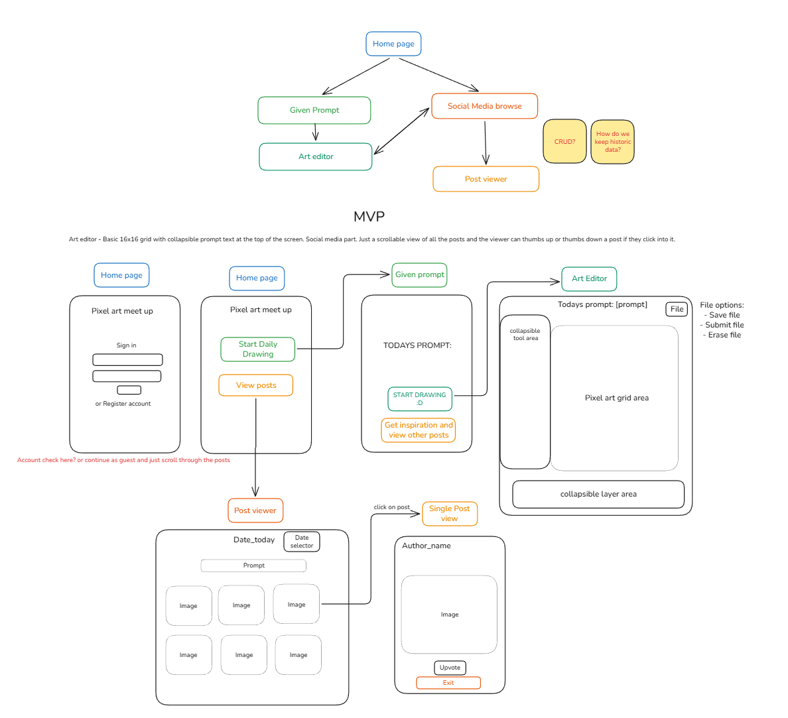

# Pixel Art Meet Up
Stay consistent through daily pixel art challenges. View other user drawings and vote. 

# Features I would like to implement

A complete app where you can practice and share your works with other pixel art enthusiasts. Practice pixel art through daily prompts.
Share your creations with others. Upvote others creations

- Daily concepts - 1 week
	- randomly generated words
	- randomly generated palettes
	- randomly generated pixel canvas sizes
	- showcase the best use of a square - square in plain sight
	- look at game jams and inktober themes and incorporate them into this
	- "movement" "free flowing"
	- keep the past ones in a txt file or smth
	- do I personally generate them or do I autogenerate them from some algorithm

- Basic pixel art environment - 1 month
	- pixel art grid with colours
	- resizable grid
		- also allowing for zooming in
	- Different layers
		- show and don't show
		- lock and don't lock
	- brush and fill function
	- eye drop - colour pick thing
	- colour picker
	- palette
		- Add colour to palette
		- choose a randomly generated palette
	- animation?
		- key frames
		- onion skin
		- tagging frames
		- playability of frames
		- changing frame duration
			- would be cool if there was a little editor panel for this
				- so you don't need to click on each frame and change hte  timing, you can just leave the UI open on the side like in unity or other programming apps, and edit it through this

- Social media aspect
	- posting 
		- having tags? maybe not - since its the same the whole time
		- Looking at history?
			- past posts for previous days
		- censor images that might have problematic things in it
	- having an account
		- awards
		- total karma
		- look at reddit
	- liking a post - can only vote a certain amount? watch an ad to vote again or pay
	- commenting on it
		- need protections on this, like censorship and reporting
	- showcasing the top posts - filtering posts on different categories
		- look to reddit and stuff for different categories\
	- looking at other peoples pixel art accounts
		- following people?
		- if we had a "relevant" filter then look at who they look at the most

## MVP
Pixel art app where you complete daily pixel art prompts. Once you've completed your prompt you can submit it (anonymously or with your account).
Pixel art
- basic ide
	- set 16x16 grid
	- colour wheel
	- 1px brush
- Post image to board
- View posts from board
- liking of posts